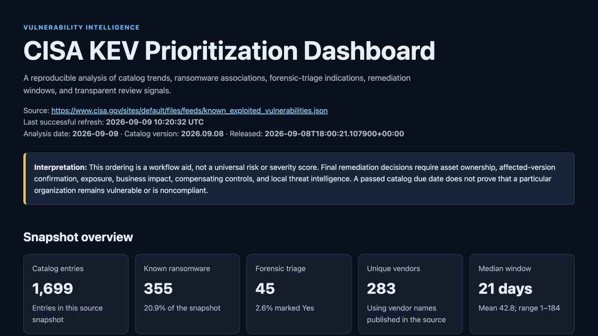
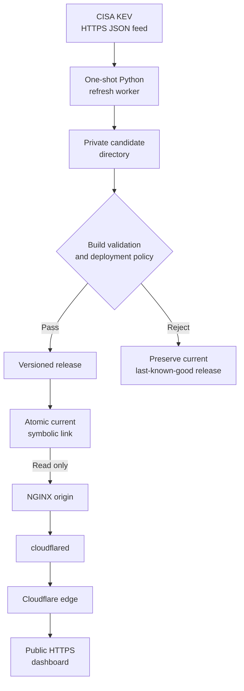

# Case study: From static KEV analysis to a live, fail-closed dashboard

This case study documents how I developed the CISA KEV Prioritization
Dashboard from a reproducible command-line report into a public, self-hosted
service. It is an independent cybersecurity portfolio project and is not
affiliated with or endorsed by CISA.

## At a glance

| Area | Project evidence |
| --- | --- |
| Problem | Turn a changing public vulnerability catalog into a transparent, reproducible review aid without implying organization-specific risk. |
| Result | A [public dashboard](https://kev.cloudsoulrider750.net/) that refreshes twice daily and preserves its last-known-good release when a refresh fails. |
| Data source | CISA's official Known Exploited Vulnerabilities JSON feed. |
| Application | Dependency-free Python 3.11+ pipeline with strict validation, deterministic analysis, CSV/JSON evidence, and self-contained HTML/SVG reporting. |
| Delivery | Hardened Docker Compose services on an Ubuntu host, a read-only NGINX origin, an outbound Cloudflare Tunnel, and a persistent systemd timer. |
| Acceptance evidence | 182 automated tests at deployment acceptance, Python 3.11–3.14 CI, CodeQL, controlled production checks, and a naturally scheduled refresh observed on 2026-09-09. |

*Public dashboard view captured on 2026-09-09. Catalog dates and values are a
dated snapshot and change as CISA updates the source feed.*

## The problem I wanted to solve

CISA maintains the KEV Catalog as an authoritative source of vulnerabilities
known to have been exploited in the wild. The feed is valuable, but raw JSON
does not by itself provide a concise operational overview, reproducible
evidence, or a transparent review sequence.

I wanted the project to answer a narrower and more defensible question:

> How can public KEV data be transformed into a trustworthy first-pass review
> queue while preserving the source evidence and clearly stating what the data
> cannot prove?

The result had to remain a workflow aid. It could not claim that an
organization owns an affected product, runs a vulnerable version, has an
exposed asset, missed remediation, or faces a specific level of risk. Those
decisions require local asset, exposure, business-impact, control, and threat
context that the public catalog does not contain.

## Design constraints

I used the following constraints to shape the implementation:

- Treat all retrieved catalog content as untrusted input.
- Accept live deployment data only from the exact approved CISA HTTPS feed.
- Keep the application free of third-party runtime packages.
- Make offline demonstrations and tests deterministic.
- Preserve the exact source snapshot and publish integrity metadata.
- Explain review ordering instead of hiding it behind an opaque score.
- Never replace a working dashboard with an incomplete, stale, or invalid
  candidate.
- Keep the web origin private and avoid host-published dashboard ports.
- Keep tunnel credentials and host-specific evidence outside the repository.
- Document limitations as carefully as successful controls.

## Architecture

The refresh worker is the only component allowed to write dashboard data.
NGINX serves only the active `current` release from a read-only volume mount.
The tunnel container does not mount the dashboard data. Separate internal and
egress networks limit which services can communicate and where they can
connect.

## Key engineering decisions

### Validate before analyzing

The parser rejects malformed catalog structures, invalid field types, invalid
dates, duplicate identifiers, and inconsistent source counts before analysis.
The live fetcher uses a bounded request, revalidates the final destination
after a redirect, limits response size, requires HTTPS, and permits only the
approved CISA source locations.

This establishes a clear trust boundary: externally supplied data does not
reach the analysis or rendering stages until it satisfies the documented
catalog contract.

### Keep prioritization transparent

The review queue uses an explicit ordering:

1. forensic-triage indication;
2. known ransomware-campaign use;
3. catalog due-date status;
4. due date; and
5. CVE identifier.

Each row retains every applicable review reason, even though one signal is
selected for aggregate reporting. `Unknown` ransomware use remains unknown
rather than being silently converted to `No`.

This approach favors explainability and reproducibility. It intentionally does
not present the result as a universal risk or severity score.

### Preserve provenance with every build

Each successful build retains the original JSON bytes and records the source
URL, catalog version, catalog release timestamp, analysis date, retrieval time,
record count, and SHA-256 snapshot digest. The generated HTML displays its
refresh time, while CSV and JSON exports support independent review.

Externally supplied text is HTML-escaped. CSV values beginning with spreadsheet
formula characters are neutralized before export. The report uses inline CSS
and accessible SVG, with no JavaScript, analytics, remote fonts, or charting
libraries.

### Publish releases atomically

A live refresh first builds in a private candidate directory. The completed
candidate must pass file-layout, metadata, snapshot-digest, record-count, CSV,
HTML, source, timestamp, and age checks. Only then can it be moved into a
versioned release directory and activated through the `current` symbolic link.

Refresh and publication locks prevent overlapping writers. Candidate names are
validated so they cannot escape the deployment root. Symbolic links and unsafe
lock-file types are rejected. If activation fails, the publication path
attempts to restore the candidate and prior `current` state.

The practical rule is simple: failure must leave the last-known-good dashboard
available.

### Separate refresh from serving

The refresh container is a one-shot worker with outbound access to CISA. It is
not a web server and exposes no port. The long-running NGINX service receives
the complete production volume as read-only and serves only the validated
active release.

This separation reduces the privileges and network access required by the
public-facing origin.

### Keep the origin private

The NGINX service is reachable only on an internal Compose network. It does not
publish port 8080 on the Ubuntu host. A separate `cloudflared` container reaches
NGINX over that private network and establishes outbound connections to
Cloudflare for the public hostname.

Cloudflare Tunnel was a useful fit because its connector initiates the
connection and does not require exposing the origin through an inbound host
port. Tunnel health and application health remain separate signals: a healthy
connector does not prove that NGINX or the publication pipeline is healthy.

### Apply least privilege at runtime

The committed container contract uses fixed non-root identities, read-only
root filesystems, dropped Linux capabilities, `no-new-privileges`, bounded CPU,
memory, process counts, and logs, plus explicit health checks. Base images are
digest-pinned, and the refresh image installs only the wheel produced by its
builder stage.

The tunnel credential is supplied as a read-only host file rather than a Git
file, Compose environment value, or process argument. Private host inventory
and raw deployment evidence also remain outside the public repository.

### Schedule an auditable one-shot operation

A hardened systemd oneshot service invokes the production refresh script. Its
timer has two daily UTC base times, up to fifteen minutes of randomized delay,
and persistent catch-up behavior after downtime.

The worker emits one structured event that distinguishes success, contention,
and other failure classes. A completed service normally returns to `inactive`;
the meaningful evidence is its result, exit status, structured event, active
release, and public metadata.

## Failure-focused verification

| Failure condition | Expected safe outcome |
| --- | --- |
| Fetch or catalog-validation failure | No publishable candidate is created; `current` is unchanged. |
| Build failure | The failed candidate is removed; the active release remains available. |
| Wrong source, stale data, or invalid timestamp | Deployment policy rejects the candidate. |
| Refresh or publication lock contention | The second operation exits distinctly without modifying active data. |
| Release-name collision | Publication stops without overwriting the existing release. |
| Activation failure | The prior `current` state is preserved or restored, and residual state is reported. |
| Tunnel interruption | The private origin remains unexposed; tunnel health monitoring reports connector availability. |
| Host failure | The public service can become unavailable because the current design has one host and one connector. |

The tests cover successful behavior and adversarial filesystem cases such as
symbolic links, hard-linked locks, foreign ownership, unsafe modes, path
escape, inconsistent metadata, digest mismatch, and incomplete output.

## Implementation journey

The work was built in reviewable stages rather than as one large deployment:

1. Build a deterministic dashboard and synthetic offline fixture.
2. Preserve snapshot provenance and validate the generated file contract.
3. Add live-deployment eligibility policy.
4. Implement versioned, atomic publication and secure locking.
5. Extract a reusable build pipeline and create one-shot refresh orchestration.
6. Package the refresh worker as a non-root production container.
7. Add the read-only NGINX origin and restricted Compose networks.
8. Add the outbound Cloudflare Tunnel and hardened systemd schedule.
9. Verify a controlled production refresh, public HTTPS route, and naturally
   scheduled refresh.
10. Publish the implementation and operations documentation through a protected
    pull request.

Several tests were intentionally written before their implementations. The
resulting failures exposed incomplete candidate cleanup, unsafe publication
edge cases, and lock-lifetime mistakes before those behaviors reached the live
deployment.

## Verification evidence

At deployment acceptance on 2026-09-09:

- the complete offline verifier passed 182 unit and contract tests;
- GitHub Actions passed on Python 3.11, 3.12, 3.13, and 3.14;
- CodeQL completed successfully for Python and workflow analysis;
- the built refresh and web images passed identity, architecture, user,
  filesystem, certificate, timezone, and configuration checks;
- the private NGINX origin passed configuration and health verification without
  creating a host port;
- a controlled first production refresh created and activated a validated
  release;
- the public HTTPS route and metadata agreed with the production release;
- a later refresh was initiated naturally by the systemd timer and preserved
  the previous versioned release; and
- tunnel health notifications were configured.

Public, reviewable evidence includes:

- [the deployment pull request](https://github.com/Soulrider750/cisa-kev-prioritization-dashboard/pull/5);
- [post-merge offline verification](https://github.com/Soulrider750/cisa-kev-prioritization-dashboard/actions/runs/34357138000);
- [post-merge CodeQL analysis](https://github.com/Soulrider750/cisa-kev-prioritization-dashboard/actions/runs/34357137686); and
- [current public metadata](https://kev.cloudsoulrider750.net/data/metadata.json).

Detailed host inventories, credential checks, temporary paths, and raw
production evidence remain private by design.

## Outcome

The project moved from a local static report to a live service without turning
the Python application into a continuously running web process. The final
design combines data validation, transparent analysis, reproducible evidence,
failure-safe publication, least-privilege containers, a private origin, and
scheduled Linux automation.

The most important result is not simply that the page is online. It is that a
failed refresh is designed and tested not to displace a previously validated
release.

## Lessons learned

- Failure paths need first-class tests. Happy-path tests did not reveal lock
  lifetime, cleanup, rollback, and unsafe-filesystem cases.
- A successful scheduler run and a changed source snapshot are different
  events. Retrieval time can advance while the catalog version and digest stay
  the same.
- Connector health, origin health, publication health, and public HTTP health
  are separate operational signals.
- Immutable image identity and an integrity-checked source transfer make host
  verification more defensible than relying on a familiar image tag or working
  directory.
- Public documentation should describe controls and outcomes while keeping
  credentials and host-specific evidence private.
- Explicit stop conditions made destructive recovery shortcuts less likely
  during troubleshooting.

## Current limitations and next improvements

This is a self-hosted portfolio service, not an enterprise vulnerability
management platform or a service with an availability guarantee. Current
limitations include:

- one Ubuntu host, one production data volume, and one tunnel connector;
- no independent external alert dedicated to refresh failure;
- no automated release-retention policy;
- no completed backup-and-restore exercise; and
- no connection to organization-specific asset, exposure, ownership,
  remediation, or business-impact data.

The next operational improvements should be designed and rehearsed against a
scratch volume before production use: a documented backup/restore exercise,
bounded release retention, and a separate refresh-failure alert.

## Skills demonstrated

| Area | Evidence in this project |
| --- | --- |
| Vulnerability management | KEV-focused review signals, remediation-window analysis, responsible-use boundaries, and exported review evidence. |
| Secure Python development | Strict parsing, bounded retrieval, output escaping, CSV-injection defense, aware datetimes, locks, cleanup, and explicit error handling. |
| Testing | Unit, integration-style, adversarial filesystem, CLI, container, Compose, NGINX, and systemd contract tests. |
| Linux administration | Ubuntu deployment layout, permissions, systemd oneshot service, persistent timer, journald evidence, and fail-closed scripts. |
| Containers and networking | Multi-stage image build, non-root execution, read-only filesystems, capability removal, resource limits, private networks, and external volumes. |
| DevSecOps | Protected pull requests, Python-version CI, CodeQL, pinned images, immutable identifiers, and release gates. |
| Technical communication | Methodology, limitations, responsible-use language, operations guidance, release records, and this case study. |

These are skills demonstrated in an independent portfolio project. They are not
presented as enterprise production experience or as proof of an organization's
security posture.

## Explore the project

- [Live dashboard](https://kev.cloudsoulrider750.net/)
- [Project README](../README.md)
- [Methodology and limitations](METHODOLOGY.md)
- [Live deployment operations](OPERATIONS.md)
- [Security policy](../SECURITY.md)
- [Publishing status](../PUBLISHING_STATUS.md)

## References

- [CISA Known Exploited Vulnerabilities Catalog](https://www.cisa.gov/known-exploited-vulnerabilities-catalog)
- [CISA KEV JSON feed](https://www.cisa.gov/sites/default/files/feeds/known_exploited_vulnerabilities.json)
- [Cloudflare Tunnel documentation](https://developers.cloudflare.com/tunnel/)
- [Docker Compose file reference](https://docs.docker.com/reference/compose-file/)
- [systemd timer documentation](https://www.freedesktop.org/software/systemd/man/latest/systemd.timer.html)
